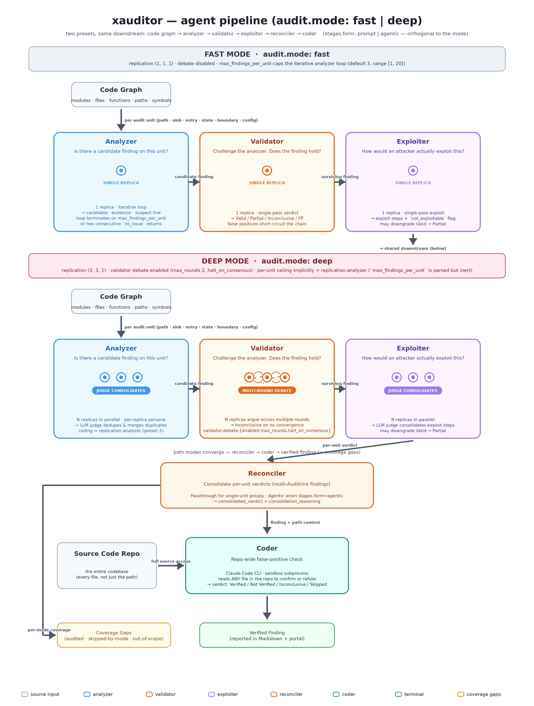

# xauditor

> **xauditor** — Whole-repository security auditing with a code graph and a 4-agent LLM verification chain. Self-hosted, evidence-first, and you can watch findings settle live.




*xauditor builds a code graph of the whole repository, enumerates audit paths through it, drives per-path LLM analysis with a validator stage, optionally fans out a 4th agent that re-reads the entire repo against each finding, and persists everything into Postgres so the portal can triage findings live.*

## Why xauditor?

Most static-analysis tools surface alerts. **xauditor's job is to make each alert defensible**: a concrete path through the code graph, an exploitation narrative, a validator verdict, and — optionally — a fourth agent backed by Claude Code that re-reads the entire repository to check the finding against sibling-module evidence (sanitisers, capability checks, control-flow guards) the path-local agents can't see.

|                            | Traditional SAST    | "Review my diff" LLM tools | xauditor                         |
|----------------------------|---------------------|----------------------------|----------------------------------|
| Whole-repo context         | Pattern rules       | File / diff window         | Code graph + path enumeration    |
| Cross-file verification    | Limited             | Manual / off-the-shelf     | 4th agent re-reads the repo      |
| Finding evidence           | Line numbers        | Inline comments            | Path + provenance + LLM verdict  |
| Human-in-the-loop triage   | Issue tracker       | None                       | Portal with feedback capture     |
| Self-hosted                | ✓                   | Mostly cloud               | ✓ (single-VM compose stack)      |

## Quickstart

Prereqs: Python 3.12+, Docker, ~2 GB free RAM, an LLM API key.

> **Docker is required** — `xauditor init` brings up Neo4j + Postgres + the portal as containers, and the coder verification stage uses Docker too. Install Docker Engine for your platform from the [official docs](https://docs.docker.com/engine/install/), then add your user to the `docker` group so the CLI works **without `sudo`**:
>
> ```bash
> sudo groupadd docker            # safe to skip if the group already exists
> sudo usermod -aG docker $USER
> newgrp docker                   # apply the new group in the current shell
> docker run --rm hello-world     # verify: should succeed without sudo
> ```
>
> If `docker run hello-world` still requires `sudo`, log out and back in (or reboot) so the group membership takes effect. On Docker Desktop (macOS / Windows) this step is unnecessary.

```bash
# 1. Install
pip install xauditor xauditor-portal xauditor-coder-service

# 2. Configure your LLM provider
cat > xauditor.yml <<'EOF'
llm:
  default_provider: openai
  providers:
    openai:
      base_url: https://api.openai.com/v1
      api_key: sk-...
      model_name: gpt-4o
EOF

# 3. Bring up Neo4j + Postgres + portal
xauditor init

# 4. Audit the current directory
xauditor audit run
xdg-open http://localhost:8080      # default login: admin / admin
```

See [`docs/quickstart-tutorial.md`](docs/quickstart-tutorial.md) for the full first-time walkthrough — prereqs, configuration, drilling into findings, capturing human feedback, and exporting runs.

## What it does

- **Builds a code graph** of every supported source file with a deterministic `build_fingerprint`, so identical repository states hit the cache instead of re-indexing.
- **Enumerates audit paths** from entry points through the call graph with caps on depth and count, so the auditor reasons about a bounded, reviewable set of flows.
- **Drives per-path LLM analysis** that demands source-backed evidence, explicit provenance, and uncertainty labels. Provider wire protocol via `kind: openai` (default) or `kind: anthropic`.
- **Validates findings** with a dedicated validator stage that outputs `Valid` / `Partial Valid` / `Inconclusive` / `False Positive` with reasoning.
- **Persists every run into Postgres** as the audit streams; the portal shows verdicts settle live.

## Supported languages

Graph extraction dispatches through a `LanguageParser` registry at [`src/xauditor/graph/parsers.py`](src/xauditor/graph/parsers.py):

| Language | Parser | Qualified-name form |
|---|---|---|
| Python | stdlib `ast` | `Class.method` |
| C, C++ | tree-sitter | C++: `Namespace::Class::method`; C: flat |
| Go | tree-sitter | `ReceiverType.Method` / bare function |
| Java | tree-sitter | `Outer.Inner.method` |
| JavaScript (`.js` / `.jsx` / `.mjs` / `.cjs`) | tree-sitter | `Class.method` / bare function |
| TypeScript (`.ts` / `.tsx`) | tree-sitter | `Class.method` / bare function |
| Kotlin (`.kt` / `.kts`) | tree-sitter | `Class.method` / `Object.method` / bare function |
| Lua (`.lua`) | tree-sitter | `Table.method` (dot or colon form) / bare function |
| Rust (`.rs`) | tree-sitter | `Type.method` (from `impl` blocks) / bare function |
| Swift (`.swift`) | tree-sitter | `Class.method` / bare function |

Files whose language has no registered parser are still inventoried (coverage knows they exist) but contribute no functions / classes / calls. Unparseable files emit a warning and are skipped without aborting the build.

## Highlights

### Audit modes — `fast` (CI) and `deep` (PSIRT)

Set `audit.mode: fast` for CI / batch scans (single-replica prompt-driven chain, ~5-10K tokens per finding) or `audit.mode: deep` for analyst-grade reviews (3-replica analyzer + validator with debate, ~50-200K tokens per finding). The same `Analyzer → Validator → Exploiter` workflow drives both — only replication, debate, and the per-unit finding cap differ. → [`docs/audit-modes.md`](docs/audit-modes.md)

### Coverage Gaps — every audit names what it didn't look at

Every run emits a per-mode `Coverage Gaps` payload — Markdown section, JSON envelope field, and a portal Coverage panel above the findings list — naming the vulnerability classes the run actually covered, the classes a different `audit.mode` would have covered, and the classes outside xauditor's scope altogether. Fast-mode runs surface a CTA banner with the `xauditor audit run --mode deep` command for the classes only deep mode reaches; deep-mode runs that skip nothing show a quiet "audited / out-of-scope" pair. Answers the operator's reasonable post-audit question: *"the tool found nothing — what didn't it look at?"* → [`docs/audit-modes.md#coverage-gaps-phase-5`](docs/audit-modes.md#coverage-gaps-phase-5)

### Coder verification — a 4th agent that reads the whole repo

Optional repo-global verification stage that uses [Claude Code](https://docs.claude.com/en/docs/claude-code) to re-read the entire repository against every finding. Verdicts (`Verified` / `Not Verified` / `Inconclusive` / `Skipped` / `Pending` / `Fail`) stream into the portal per-finding the moment each verification settles. Subprocess transport for dev machines, HTTP transport with a hardened multi-project sandbox container for production. → [`docs/coder.md`](docs/coder.md)

### Portal — triage UI with live progress

Two-container FastAPI + Next.js portal joined to the same Postgres the audit runtime writes into. Three-role RBAC (`admin` / `auditor` / `viewer`) with an admin-only **Users** tab, hierarchical run drill-in, filterable findings, human feedback capture (`true_positive` / `false_positive`), admin-only run management (cancel / complete / delete with audit log), and JSONL export for RL post-training pipelines. → [`docs/portal.md`](docs/portal.md)

### Self-hosted compose stack

Single-VM docker-compose deployment that runs Neo4j + Postgres + portal + internal PyPI index + analyst-install HTTP server. → [`deploy/README.md`](deploy/README.md)

## Documentation

| Topic | Location |
|---|---|
| Quickstart tutorial (first-time walkthrough) | [`docs/quickstart-tutorial.md`](docs/quickstart-tutorial.md) |
| Configuration reference (xauditor.yml + env vars) | [`docs/configuration.md`](docs/configuration.md) |
| LLM providers (`kind: openai` vs `kind: anthropic`) | [`docs/providers.md`](docs/providers.md) |
| CLI reference (every command) | [`docs/cli.md`](docs/cli.md) |
| Coder verification (4th agent) | [`docs/coder.md`](docs/coder.md) |
| Audit modes (`fast` / `deep`) | [`docs/audit-modes.md`](docs/audit-modes.md) |
| Audit parallelism (`audit.worker_count`) | [`docs/audit-parallelism.md`](docs/audit-parallelism.md) |
| Portal (web UI + Settings tab) | [`docs/portal.md`](docs/portal.md) |
| Portal Settings page reference | [`docs/portal-settings.md`](docs/portal-settings.md) |
| Reports (JSON envelope + Markdown bundle) | [`docs/reports.md`](docs/reports.md) |
| Self-hosted deployment | [`deploy/README.md`](deploy/README.md) |
| Coder service deployment | [`deploy/coder-service/README.md`](deploy/coder-service/README.md) |
| Release notes & migration runbooks | [`CHANGELOG.md`](CHANGELOG.md) |

Browse the full topical index at [`docs/README.md`](docs/README.md).

## Project status

Active development. Current version: **1.0.0**. Breaking changes are reserved for major-version bumps and always paired with a runbook in [`CHANGELOG.md`](CHANGELOG.md). The JSON export envelope is versioned (`format_version: "1"`) and intended as a stable downstream contract.

## Contributing

Issues and feature requests are welcome on GitHub. There is no formal `CONTRIBUTING.md` yet — open an issue to discuss before sending non-trivial PRs.

## License

See [`LICENSE`](LICENSE).
